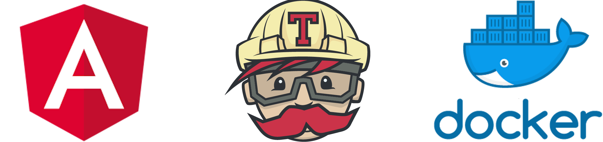

  

---

  

 

# Tours Admin

A Tour Manage System built with Angular and using some good development practices like: automated tests with coverage follow up and CI tool, docker automated builds.

More is coming...

> Note: This project was generated with [Angular CLI](https://github.com/angular/angular-cli) version 11.2.1.

---

## Topics

- [Features / ToDo](#features--todo)
- [Requirements](#requirements)
- [Installation (development)](#installation-development)
- [Deploy (production)](#deploy-production)
- [References](#references)

---

## Features / ToDo

- [ ] Docker environments (production and development)
- [x] Write tests and use some CI tool
- [ ] Manage users, tours, reviews and bookings
- [ ] GraphQL

...

---

## Requirements

- NodeJS
- npm

**And running [Tours Nest API](https://github.com/chsjr1996/tours-nest-api).**

---

## Installation (development)

- `git clone https://github.com/chsjr1996/tours-admin.git`
- `npm install`
- `npm start` - **_run and watch modifications_**

---

## Deploy (production)

Run `npm run build:prod` to build the project. The build artifacts will be stored in the `dist/` directory.

---

## References

This repository is based on some articles and videos. I used them as study object, then here has some differences because I merged several concepts and did some adjusts.

- [Angular Docs](https://angular.io/docs)
- [Material Angular Components](https://material.angular.io/components)
- [Overall structural guidelines](https://angular.io/guide/styleguide#file-tree)
- [Stop Using Shared Material Module](https://indepth.dev/posts/1191/stop-using-shared-material-module)
- [Configuring Travis CI for Angular application](https://medium.com/faun/configuring-travis-ci-for-angular-application-34afee1715f)
- [The Angular DevOps Series: CT/CI with Travis CI and GitHub Pages](https://medium.com/angular-in-depth/the-angular-devops-series-ct-ci-with-travis-ci-and-github-pages-3c02664f078)

---

## Under development

If you see any error or want a new feature, please open a issue!
